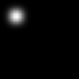
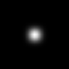

Pixel bias in U-Net style segmentation
======================================
The aim of this experiment is to get a little bit more insight into where a
neural network with a U-Net architecture can take information from.

| Results |
|---------|
| `./main.py -x 0 -y 0`
| 
| `./main.py -x 30 -y 30`
| 